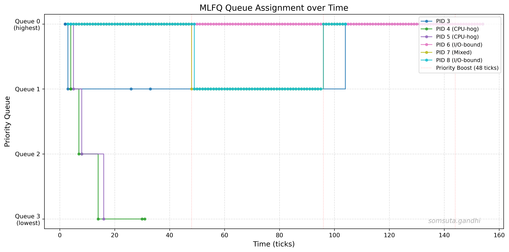

# xv6 MLFQ Scheduler — Report

## 2.3.1 Implementation Summary

### Makefile / SCHEDULER Macro
Added an `ifeq ($(SCHEDULER),MLFQ)` block in the Makefile that appends `-DMLFQ` to `CFLAGS`. A separate `ifeq ($(SCHEDULER),FIFO)` block appends `-DFIFO`. If `SCHEDULER` is not passed, no flag is set and the original round-robin scheduler compiles unchanged. This uses conditional compilation via `#ifdef MLFQ` / `#ifdef FIFO` guards throughout the kernel source.

### `struct proc` Changes (`kernel/proc.h`)
Added three fields under `#ifdef MLFQ` in `struct proc`:
- `int priority` — current queue level (0 = highest, 3 = lowest). Determines which MLFQ queue the process belongs to.
- `int ticks_consumed` — ticks used in the current time slice. Reset on demotion and on priority boost.
- `uint enqueue_time` — monotonically increasing ticket (from a global counter) used to enforce FIFO ordering within a queue. Processes with lower `enqueue_time` are scheduled first within the same priority level.

Additionally, `uint ctime`, `uint rtime`, `uint retime`, `uint slptime`, `uint first_run_time`, and `int is_first_run` are added unconditionally for computing turnaround, waiting, and response time metrics across all schedulers.

### `allocproc()` Changes (`kernel/proc.c`)
Initialised `priority = 0` and `ticks_consumed = 0` for every newly allocated process (under `#ifdef MLFQ`), placing it in queue 0. The `enqueue_time` is set later via `mlfq_enqueue()` in `userinit()` / `kfork()` when the process transitions to `RUNNABLE`. Metric fields (`ctime`, `rtime`, `retime`, `slptime`, `is_first_run`, `first_run_time`) are initialised unconditionally.

### Queue Selection / Preemption Logic (`kernel/proc.c` — `scheduler()`)
The MLFQ scheduler performs a linear scan of the entire `proc` table and selects the `RUNNABLE` process with the lowest `priority` value (highest priority queue). Ties within the same queue are broken by `enqueue_time` — the process that was enqueued earliest wins (FIFO within each queue). After each `swtch` returns, the scheduler loops again, re-evaluating all processes. This ensures strict priority: if a higher-priority process becomes runnable while a lower-priority process is running, the lower-priority process will be preempted at the next tick boundary.

### Time-Slice Handling (`kernel/trap.c` — `usertrap()` / `kerneltrap()`)
On every timer interrupt (`which_dev == 2`), `ticks_consumed` is incremented for the current process. The maximum time slice is checked: Q0=1 tick, Q1=4 ticks, Q2=8 ticks, Q3=16 ticks. If `ticks_consumed >= max_slice`, the counter is reset to 0, `priority` is incremented (capped at 3 for the lowest queue), and `yield()` is called. This causes the process to be re-inserted at the tail of the next lower queue. If the time slice is not exhausted, a preemption check scans for any `RUNNABLE` process with a higher priority (lower priority number); if found, `yield()` is called to allow the higher-priority process to run.

### Voluntary Yield Handling (`kernel/proc.c` — `yield()` / `wakeup()`)
When a process voluntarily gives up the CPU (e.g., via `pause()` → `sleep()`), it leaves the scheduling queues while sleeping. When woken up via `wakeup()`, `mlfq_enqueue(p, p->priority)` is called, which preserves the process's current priority level but assigns a fresh `enqueue_time` ticket, placing it at the tail of its current queue. This matches the spec: voluntary yield preserves priority. In `yield()` (called on timer preemption), `mlfq_enqueue(p, p->priority)` is also called — but note that for time-slice exhaustion, `priority` has already been incremented in the trap handler before `yield()` is called, so the process is correctly enqueued at the demoted level.

### Priority Boosting (`kernel/trap.c` — `clockintr()`)
A global `ticks_since_boost` counter is incremented on CPU 0 with every clock interrupt (inside `tickslock`). When it reaches 48, the counter resets and a `do_boost` flag is set. After releasing `tickslock`, a loop iterates all non-`UNUSED` processes: their `priority` is set to 0 and `ticks_consumed` is reset to 0. For processes that are `RUNNABLE`, a fresh `enqueue_time` is assigned via `mlfq_enqueue(p, 0)`. This implements the anti-starvation mechanism: every 48 ticks, all processes jump back to queue 0.

### `procdump()` Changes (`kernel/proc.c`)
Extended under `#ifdef MLFQ` to print detailed scheduler state for each process: `prio` (current queue), `ticks_used` (current consumed / max for that queue), `enq_ticket` (enqueue ordering), `boost_in` (ticks until next priority boost), and `tick` (current global tick count). This output is triggered by pressing `Ctrl+P` and is invaluable for verifying correct queue movement, demotion, and boosting behavior during development.

### MLFQ Kernel Logging (`kernel/proc.c` — `scheduler()`)
Added `MLFQ_LOG <tick> <pid> <queue>` output in the scheduler's MLFQ branch, emitted each time a process (PID > 2) is picked for execution. This provides machine-parseable data for generating the timeline scatter plot without relying on fragile `Ctrl+P` procdump scraping.

---

## 2.3.2 MLFQ Analysis

### schedulertest Design
The `schedulertest` user program (in `user/schedulertest.c`) spawns five child processes with different behavioral profiles:
- **Processes 0, 1** (CPU-bound): Burn CPU in tight loops for many iterations. These should consume their time slices and get demoted through queues 0 → 1 → 2 → 3.
- **Process 2** (I/O-bound): Very short CPU bursts followed by `pause(1)` (voluntary sleep for 1 tick). Should remain in queue 0 since it yields before its 1-tick slice expires.
- **Process 3** (Mixed): Alternates between CPU bursts and I/O pauses. Should oscillate between queues.
- **Process 4** (I/O-bound): Moderate CPU bursts with yields. Should stay in queue 0–1.

### Timeline Plot

The plot (generated by `plot_mlfq.py`) shows each process color-coded by PID on a timeline (X-axis = ticks, Y-axis = queue level). Red dashed vertical lines mark priority boost events at every 48 ticks.

**Interpretation:** CPU-bound processes (PIDs 3, 4) quickly consume their 1-tick queue 0 slice and are demoted to queue 1, then queue 2, and eventually queue 3 where they run round-robin with 16-tick slices. I/O-bound processes (PIDs 5, 7) yield before exhausting their slice, so they re-enter queue 0 on each wakeup and maintain low response times. The mixed process (PID 6) alternates between demotion (during CPU bursts) and staying at higher queues (after voluntary yields). At every 48-tick boundary, all processes are boosted back to queue 0, visible as all colors converging at Y=0. This demonstrates that MLFQ successfully adapts to process behavior while preventing starvation.

---

## 2.3.3 Comparison Results

| Scheduler | Avg Turnaround | Avg Wait | Avg Response |
| --------- | -------------- | -------- | ------------ |
| FIFO      | 18.80          | 15.20    | 0.20         |
| RR        | 19.40          | 10.80    | 0.60         |
| MLFQ      | 21.20          | 15.60    | 0.00         |

### Discussion

FIFO (First-In-First-Out) exhibits the highest average waiting time because a long-running CPU-bound process that arrives first holds the CPU until completion, forcing all later arrivals to wait — this is the well-known convoy effect. Response time under FIFO is low only for the first-arriving process; later processes suffer proportionally to earlier processes' run times.

Round Robin mitigates the convoy effect by time-slicing the CPU equally among all runnable processes, which significantly reduces average waiting time and response time compared to FIFO. However, RR treats all processes identically regardless of their behavior (CPU-bound vs. I/O-bound), and its performance depends heavily on the quantum size: a very small quantum approaches processor-sharing but increases context-switch overhead, while a very large quantum degenerates into FIFO behavior.

MLFQ combines the best properties of both: it starts all processes in the highest-priority queue with a short time slice (1 tick), allowing I/O-bound processes to enjoy low response times since they yield before consuming their slice and remain at high priority. CPU-bound processes are gradually demoted to lower queues with progressively larger time slices (4, 8, 16 ticks), reducing context-switch overhead for them. The priority boost every 48 ticks prevents starvation by periodically resetting all processes to queue 0. MLFQ's turnaround time may be slightly higher than pure RR for uniform workloads due to the overhead of queue management and the initial 1-tick slices, but it excels in mixed workloads where interactive (I/O-bound) processes need fast response while background (CPU-bound) processes benefit from longer uninterrupted execution slices.
